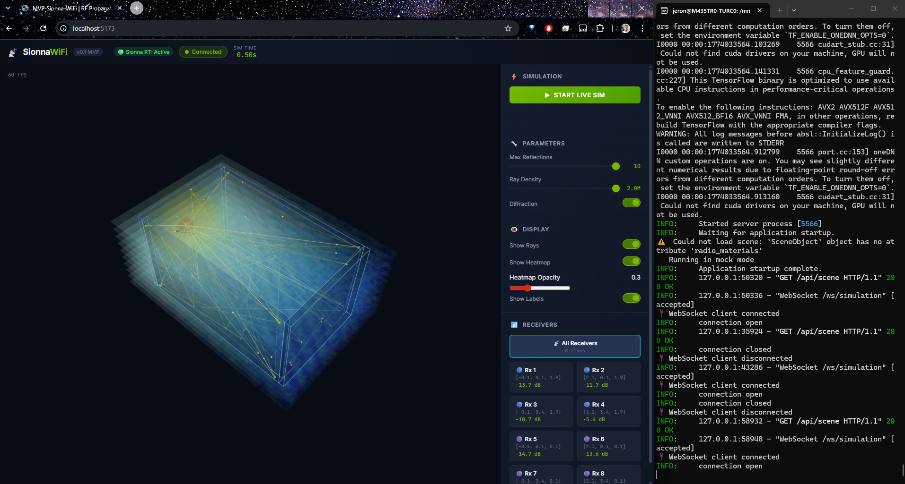
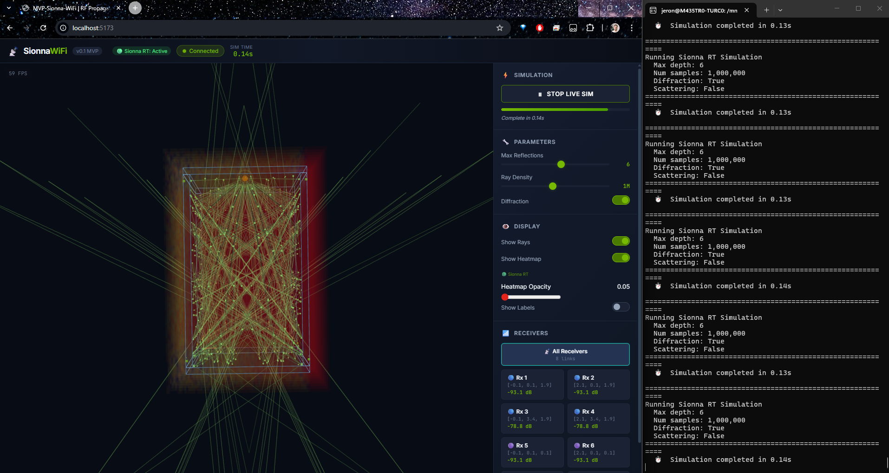
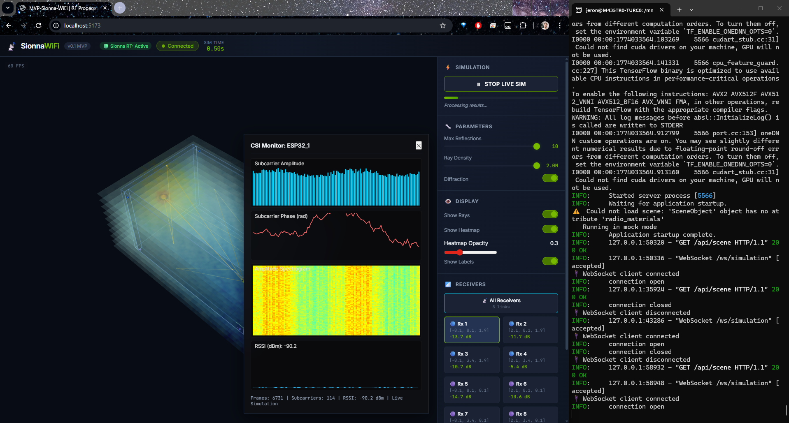
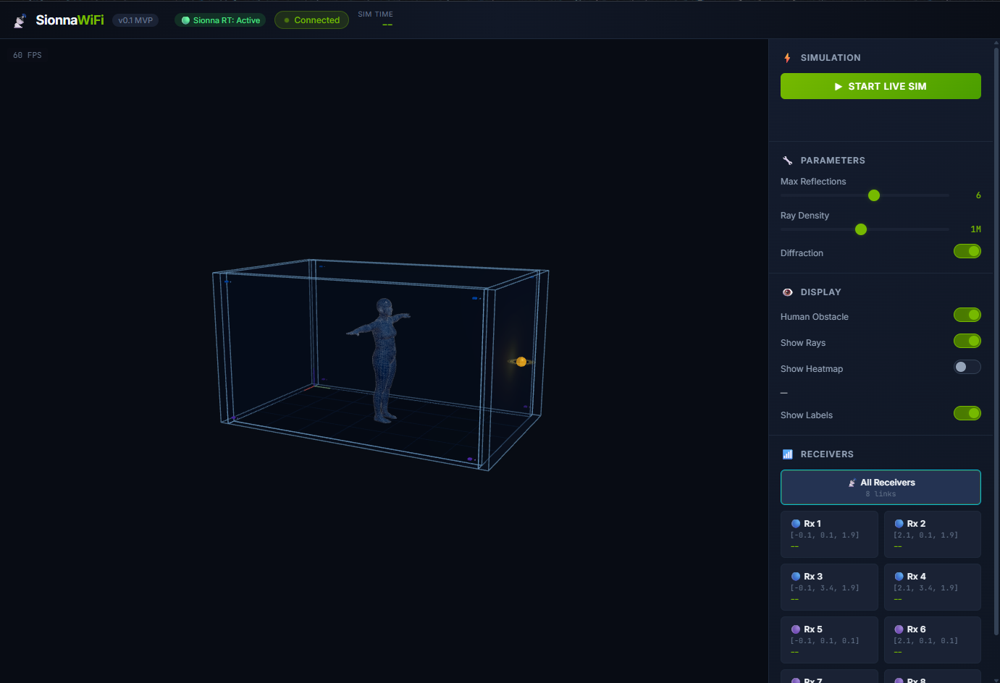
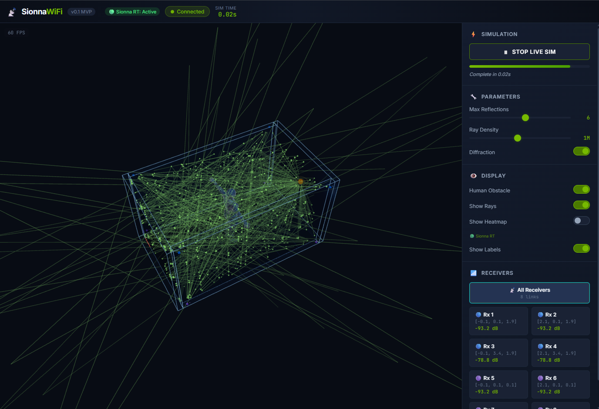

# MVP-Sionna-WiFi

#An end-to-end 3D Digital Twin built for real-time visualization of Wi-Fi (802.11) radio propagation, using NVIDIA Sionna's ray tracing engine and Three.js.




A virtual test room with **8 ESP32-S3 receivers** and **1 WiFi router** — built as a learning project to explore ray-tracing-based RF simulation before tackling the full [WiFi Vision 3D](https://github.com/JeronimoRepetto/wifi-csi-capture) research pipeline.


## Overview

This project creates a **100% virtual** simulation environment:

1. **Blender** → Model a concrete room with ITU-standard materials
2. **Mitsuba 3** → Export scene geometry as XML
3. **Sionna RT** → Run differentiable ray tracing (SBR algorithm) at 2.437 GHz
4. **SMPL/SMPLX** → Generate realistic 6,890-vertex human body meshes as dynamic RF obstacles
5. **Three.js** → Visualize the room, sensors, ray paths, human models, and signal coverage in real time

## Room Configuration

| Parameter       | Value                                          |
| --------------- | ---------------------------------------------- |
| Room dimensions | 2.0 × 3.5 × 2.0 m                              |
| Wall thickness  | 0.12 m                                         |
| Wall material   | `itu_brick` (ITU-R P.2040)                     |
| Floor/Ceiling   | `itu_concrete`                                 |
| WiFi frequency  | 2.437 GHz (Channel 6)                          |
| Bandwidth       | 40 MHz (HT40, 802.11n)                         |
| Subcarriers     | 114 (108 data)                                 |
| Transmitter     | 1 × Router (behind back wall, Y=3.62m, Z=1.0m) |
| Receivers       | 8 × ESP32-S3 (4 high Z=1.9m + 4 low Z=0.1m)    |

### Sensor Layout

```
        2.0 m
   ┌─────────────┐
   │ ESP1    ESP2 │  ← Z = 1.9m (high)
   │              │
   │              │  3.5 m
   │              │
   │ ESP3  R ESP4 │  ← R = Router (behind wall)
   └─────────────┘

   + mirrored at Z = 0.1m (ESP5–ESP8)
   All ESP32s placed OUTSIDE walls (±0.12m)
   Signal penetrates through walls via refraction
```

## SMPL Human Body Integration

> [!IMPORTANT]
> **The SMPL model files (`.pkl`) are NOT included in this repository** due to [Max Planck Institute (MPI-IS) licensing restrictions](https://smpl.is.tue.mpg.de/). You must download them separately and place them in `backend/models/smpl/`. See the [SMPL setup guide](docs/INSTALL_WSL2_GPU.md#10-smpl-human-integration-optional) for step-by-step instructions.

The simulation includes a realistic **SMPL human body model** (6,890 vertices) injected as an RF obstacle into the Sionna RT scene. The human body is modeled with `itu_wet_ground` dielectric properties (high permittivity ≈ water), closely approximating the electromagnetic behavior of living tissue at 2.4 GHz.



When the **Human Obstacle** toggle is enabled, the SMPL mesh is dynamically injected into the Mitsuba scene XML and the ray tracing engine recalculates all propagation paths — including absorption, reflection, and diffraction around the human body.



### Walking Animation

The **Play Walk** animation system moves the human model across the room while running a Sionna RT simulation per frame. This lets you observe how human movement affects WiFi signal propagation, ESP32 readings, and heatmap coverage in real-time. Controls include:

- **Play/Pause** button to start/stop the walk animation
- **Speed** slider (0.5x–2.0x)
- **Frames** slider (8–32 frames per walk cycle)
- **Frame counter** showing current progress


## Architecture

```
Blender Script ──XML──► Mitsuba 3 ──► Sionna RT ──► FastAPI ──WS──► Three.js
(generate_room.py)      (parser)      (ray trace)    (backend)       (frontend)
```

## Project Structure

```
MVP-Sionna-Wifi/
├── blender/
│   ├── generate_room.py      # Procedural room generation (run in Blender)
│   └── export_scene.py       # Export to Mitsuba XML
├── scenes/                   # Exported XML scenes
├── backend/
│   ├── config.py             # Physical parameters & sensor positions
│   ├── scene_loader.py       # Load XML into Sionna RT
│   ├── simulation.py         # Ray tracing engine (SBR)
│   ├── smpl_manager.py       # SMPL human model generation (smplx + trimesh)
│   ├── pose_library.py       # Walking keyframes & animation sequence generation
│   ├── main.py               # FastAPI server
│   ├── models/smpl/          # ⚠️ SMPL .pkl files (gitignored — see setup guide)
│   └── requirements.txt
├── frontend/
│   ├── src/
│   │   ├── main.js           # Entry point
│   │   ├── scene3d.js        # Three.js room renderer
│   │   ├── rays.js           # Ray path visualization
│   │   ├── sensors.js        # Tx/Rx markers
│   │   ├── human.js          # SMPL human model loader & positioning
│   │   ├── heatmap.js        # Coverage overlay
│   │   ├── controls.js       # UI panel
│   │   └── websocket.js      # WS client
│   ├── index.html
│   ├── style.css
│   └── package.json
├── docs/
│   ├── HOW_IT_WORKS.md       # Technical deep-dive
│   └── INSTALL_WSL2_GPU.md   # GPU setup guide (WSL2 + OptiX)
├── internDocs/               # Internal documentation (not pushed)
│   ├── BLENDER_ROOM_GUIDE.md # How to create custom rooms
│   ├── FRONT_EXP.md          # Frontend architecture
│   └── BACK_EXP.md           # Backend architecture
└── README.md
```

## Hardware Requirements

> [!CAUTION]
> **Sionna RT performs intensive ray tracing calculations.** Running on CPU can cause **high temperatures and heavy CPU load** (100% across all cores). Monitor your system temperatures during simulation. Consider reducing `Max Reflections` and `Ray Density` in the UI if your system overheats.

### GPU Mode (Recommended)

| Component | Minimum                    | Recommended                  |
| :-------- | :------------------------- | :--------------------------- |
| **GPU**   | NVIDIA GTX 1060 (6GB VRAM) | NVIDIA RTX 3060+ (8GB+ VRAM) |
| **CUDA**  | 11.8+                      | 12.0+                        |
| **RAM**   | 8 GB                       | 16 GB                        |
| **CPU**   | 4 cores                    | 8+ cores                     |
| **OS**    | Ubuntu 20.04 / WSL2        | Ubuntu 22.04 / WSL2          |

💡 With GPU acceleration, each simulation frame takes **~0.02–0.05s**.

### CPU-Only Mode (Fallback)

| Component | Minimum                          | Recommended                           |
| :-------- | :------------------------------- | :------------------------------------ |
| **CPU**   | Intel i5 / AMD Ryzen 5 (4 cores) | Intel i7/i9 / AMD Ryzen 7+ (8+ cores) |
| **RAM**   | 16 GB                            | 32 GB                                 |
| **OS**    | Ubuntu 20.04 / WSL2              | Ubuntu 22.04 / WSL2                   |

⚠️ Without GPU, each simulation frame takes **~0.15–0.5s** and uses **100% CPU**. Long sessions may cause thermal throttling.

### Software Requirements

- **Python** 3.10–3.11 (required by Sionna)
- **Blender** 3.6+ (for room modeling only)
- **Node.js** 18+ (for frontend)

### Python Dependencies

```
sionna-rt
mitsuba>=3.0
tensorflow[and-cuda]
numpy
fastapi
uvicorn
websockets
smplx
torch
trimesh
chumpy  # Install with: pip install --no-build-isolation chumpy
```

## Setup & Installation (Windows / WSL2)

NVIDIA Sionna requires a Linux environment to utilize hardware GPU acceleration via TensorFlow. On Windows, you MUST use WSL2 (Ubuntu).

> For detailed GPU setup (OptiX + CUDA), see [docs/INSTALL_WSL2_GPU.md](docs/INSTALL_WSL2_GPU.md)

### Quick Start

**1. Prepare WSL2**

```bash
wsl --install -d Ubuntu-22.04
```

**2. Install Conda + Python in WSL2**

```bash
wget https://repo.anaconda.com/miniconda/Miniconda3-latest-Linux-x86_64.sh
bash Miniconda3-latest-Linux-x86_64.sh -b
~/miniconda3/bin/conda init bash
source ~/.bashrc
conda create -n sionna python=3.11 -y
conda activate sionna
```

**3. Install Backend Dependencies**

```bash
cd /mnt/c/Users/<YOUR_USERNAME>/Desktop/MVP-Sionna-Wifi/backend
pip install -r requirements.txt
pip install sionna-rt tensorflow[and-cuda]
```

**4. (Optional) Enable GPU OptiX** — see [GPU Setup Guide](docs/INSTALL_WSL2_GPU.md)

**5. Start Backend (WSL2 Terminal)**

```bash
conda activate sionna
cd /mnt/c/Users/<YOUR_USERNAME>/Desktop/MVP-Sionna-Wifi/backend
python main.py
```

Check the console for the active backend:

| Log Message                              | Meaning                             |
| ---------------------------------------- | ----------------------------------- |
| `🟢 Mitsuba backend: CUDA + OptiX (GPU)` | Full GPU acceleration               |
| `🟡 Mitsuba backend: LLVM (CPU)`         | CPU fallback (OptiX not configured) |
| `⚠️ Sionna/Mitsuba not installed`        | Mock mode (install dependencies)    |

**6. Start Frontend (Windows PowerShell)**

```bash
cd frontend
npm install
npm run dev
```

Open `http://localhost:5173` in your browser.

## Roadmap

| Version  | Description                               |
| :------: | ----------------------------------------- |
|   v0.1   | Room + Sionna RT + Visualization          |
|   v0.2   | SMPL body model as obstacle               |
| **v0.3** | ← Current: Animated human movement + CSI  |
|   v0.4   | Compare simulated vs real CSI (ESP32)     |
|   v0.5   | Full pose estimation pipeline integration |

## Related Projects

- [WiFi Vision 3D (wifi-csi-capture)](https://github.com/JeronimoRepetto/wifi-csi-capture) — The main research project
- [NVIDIA Sionna](https://github.com/NVlabs/sionna) — Open-source library for communication systems
- [Mitsuba-Blender](https://github.com/mitsuba-renderer/mitsuba-blender) — Blender integration for Mitsuba 3

## License

MIT
